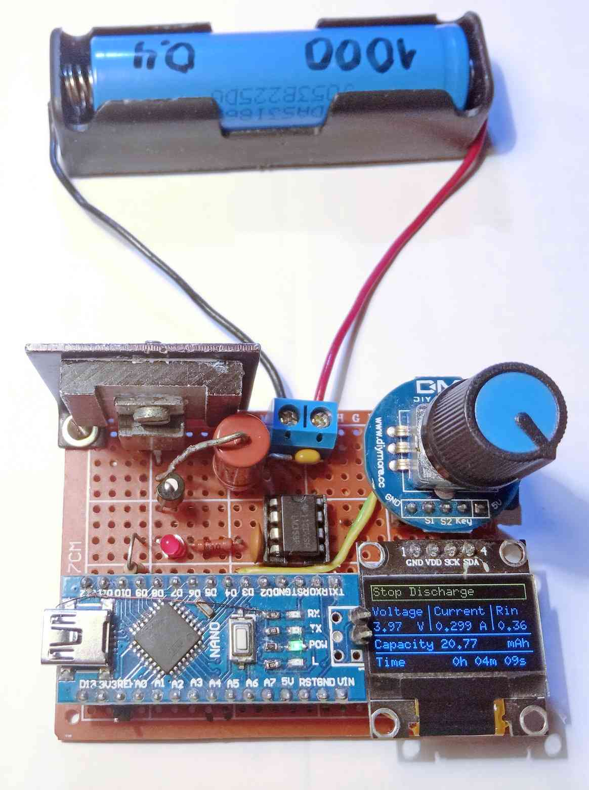
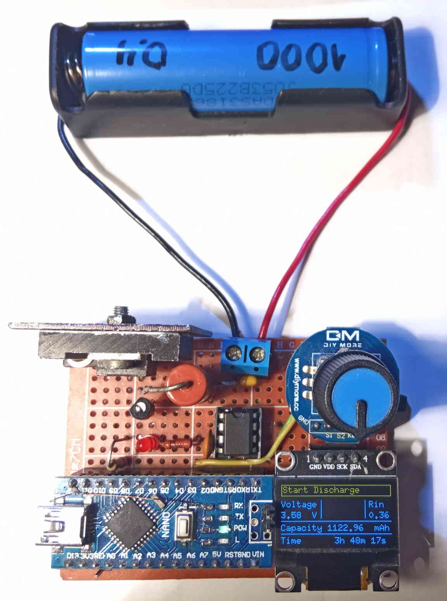
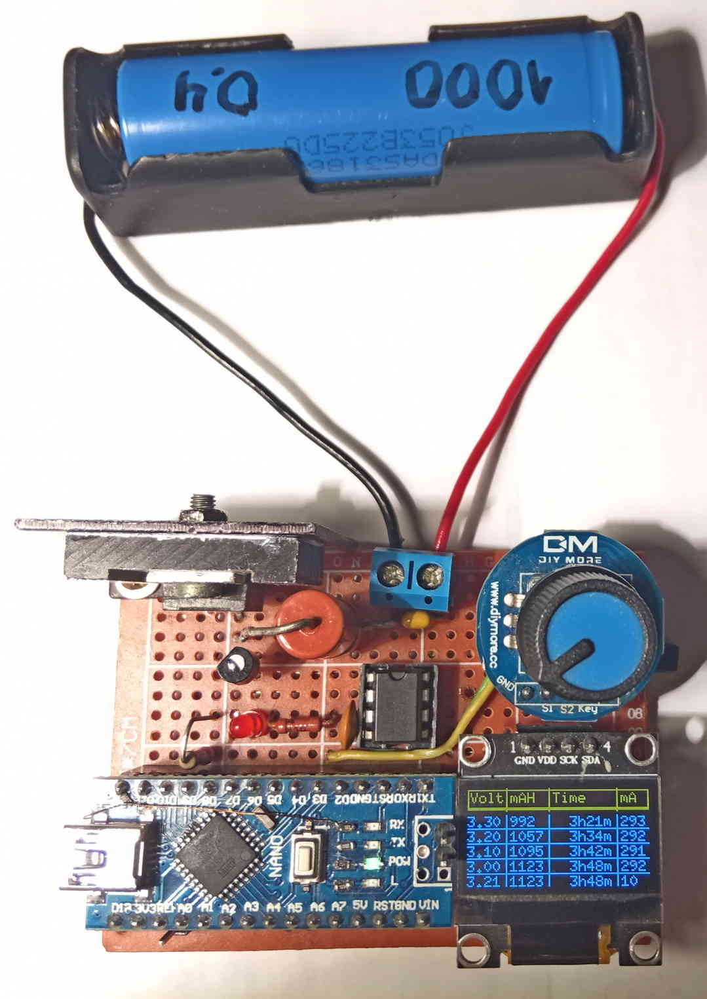
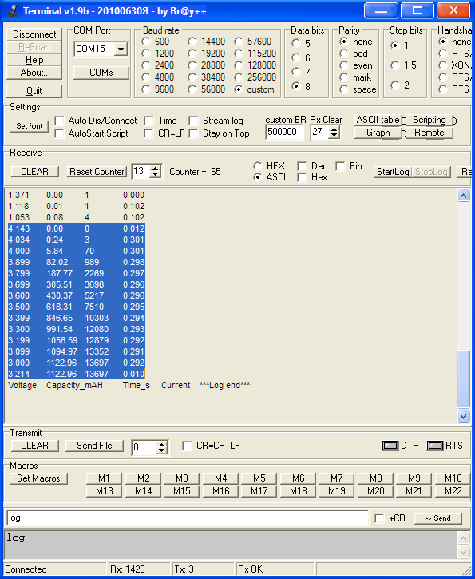
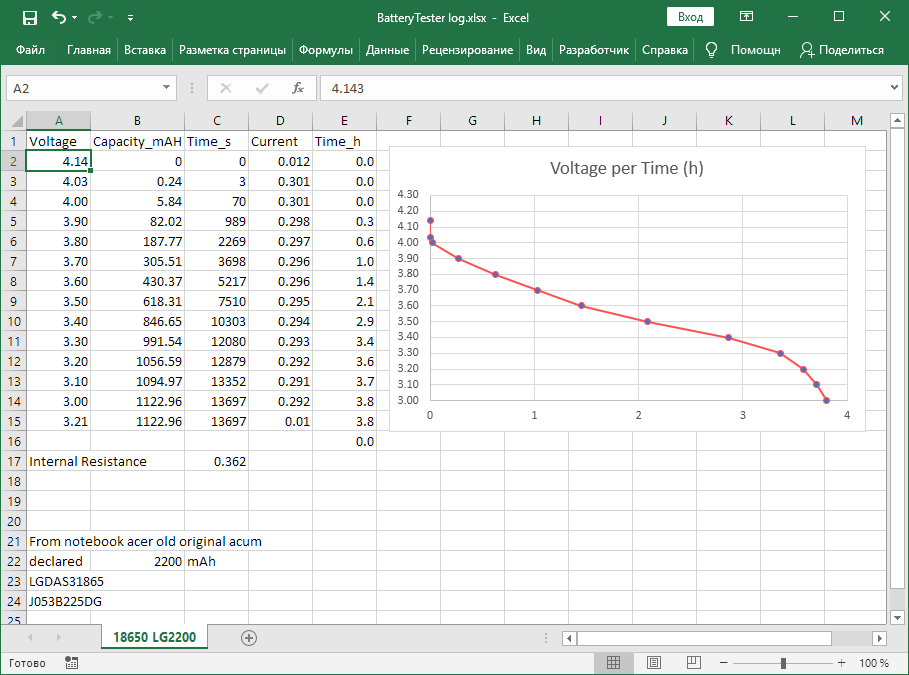
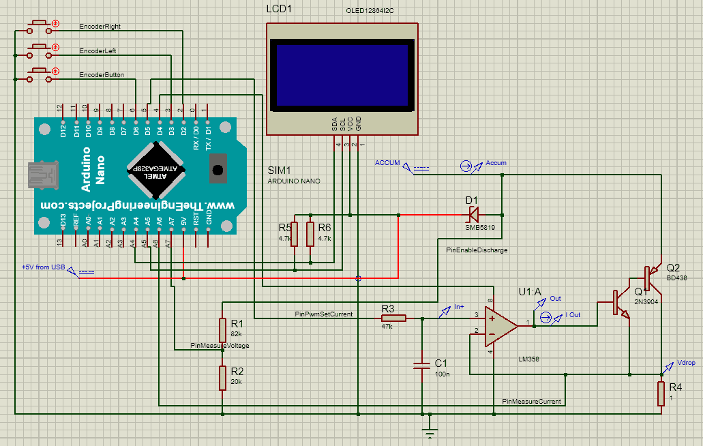
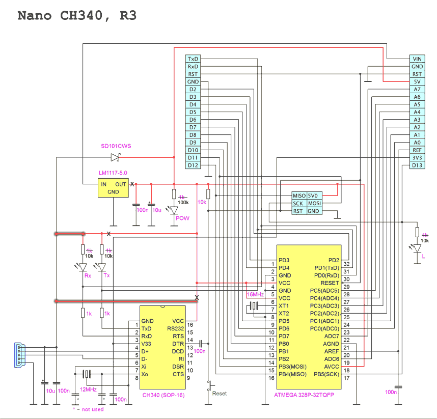
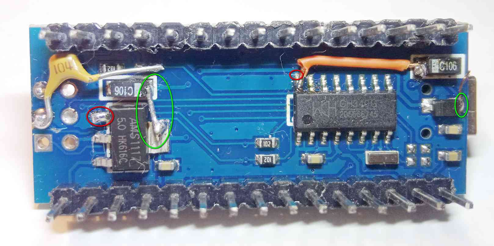
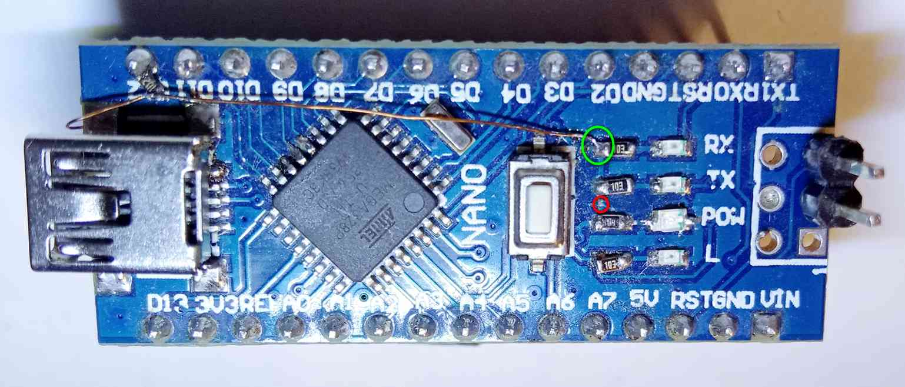
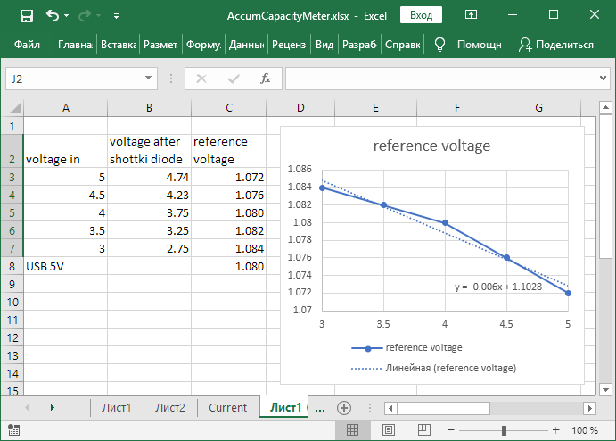

# BatteryTester


BatteryTester — это тестер для измерения ёмкости литий-ионных аккумуляторов на базе Arduino Nano и фреймворка Arduino. 

Изначально тестер измерял только ёмкость аккумуляторов и назывался AccumCapacityMeter. Позже было добавлено измерение внутреннего сопротивления, а также добавлена настройка конечного напряжения разряда. Это дало возможность проверять не только аккумуляторы, но и в принципе любые источники тока до 5В. Проект был переименован в BatteryTester. 


*Фото. BatteryTester после начала разряда аккумулятора* 

Тестер имеет энкодер для управления и экран для отображения результатов измерения, настроек и лога.

Перед началом измерения нужно настроить ток разряда (по умолчанию 0,1А, максимальный ток 1А) и конечное напряжение разряда (по умолчанию 3В).

На экране отображается напряжение подключенного аккумулятора (либо другого источника тока), если идёт разряд - текущий ток разряда, также отображаются ёмкость, отданная аккумулятором с начала разряда, и время, которое длится разряд.

В начале разряда (в первые 3с) измеряется внутреннее сопротивление аккумулятора и также выводится на экран.
 

*Фото. BatteryTester после окончания разряда. Замеренная ёмкость – 1123 мАч, внутреннее сопротивление – 0,36 Ом.*

Тестер ведёт лог разряда, он записывается в EEPROM. Каждый раз, когда напряжение на аккумуляторе снижается на 0,1В, в лог заносятся текущие значения напряжения, тока, ёмкости и времени. Прочитать лог можно либо через COM-порт, либо посмотрев на экране устройства перейдя в соответствующую вкладку. 

 
*Фото. BatteryTester, выбрано отображение лога*

Лог можно прочитать из тестера, подключившись к нему через COM-порт (по USB, в Arduino Nano встроен преобразователь COM-USB) используя программу терминал COM-порта (например [эту](./doc/Terminal.exe)). Параметры подключения: скорость 500000, всё остальное стандартное (8 data bits, 1 stop bit, parity none). Для считывания лога нужно послать в COM-порт “log”.
  

*Скриншот терминала*

Данные в логе разделены табуляцией, поэтому их можно напрямую скопировать из программы терминала и вставить в Excel, там данные автоматически разобьются по колонкам. В Excel ([пример файла](./doc/BatteryTester-log.xlsx)), можно строить такие графики разряда:
  

## Электрическая схема устройства
 
  

Ток разряда задаётся ШИМ на пине pinPwmSetCurrent, дальше с помощью RC-цепочки (R3C1) получается постоянное напряжение, пропорциональное заполнению ШИМ. Дальше, с помощью схемы на операционном усилителе, поддерживается такое же напряжение на шунте R4, соответственно, устанавливается ток через этот шунт, и, соответственно, ток разряда аккумулятора.

Замер тока разряда производится тут же на шунте и подаётся на пин МК pinMeasureCurrent.

Замер напряжения аккумулятора производится с помощью делителя R1R2 и подаётся на пин pinMeasureVoltage.

Пин pinEnableDischarge отвечает за включение схемы разряда и подаёт питание на операционный усилитель. Пока разряд не начался на этом пине выставляется 0, и схема разряда полностью отключена. Без снятия питания с ОУ небольшой ток разряда был даже тогда, когда ШИМ был выставлен в 0.


Тестер может питаться либо от порта USB, либо напрямую от исследуемого аккумулятора (только если его напряжение находится в диапазоне от 3 до 5В). Второй вариант – основной, поэтому в схеме и программе особое внимание уделялось правильной работе тестера при изменении напряжения питания (оно снижается по мере разряда). 
При питании от самого аккумулятора:
*	ток, потребляемый самим тестером, учитывается в измерениях, и замер ёмкости производится правильно;
*	учитывается изменение амплитуды ШИМ, так как оно равно напряжению питания;
*	была модифицирована сама схема Arduino Nano для снижения потребления;
*	реализован режим глубокого сна после окончания разряда. 
 
После окончания разряда (при достижения конечного напряжения разряда) тестер записывает последние показания в лог, выключает экран и уходит в глубокий сон. При этом потребляемый ток не превышает 0,1мА, и при питании от самого исследуемого аккумулятора, не происходит его дальнейший разряд. Выйти из сна можно повернув энкодер в любую сторону.  

**Внимание: подключение аккумулятора (или другого источника) с напряжением выше 5В выведет из строя микроконтроллер, так как он питается от аккумулятора практически напрямую (только через диод Шоттки)**.

Наименования транзисторов на схеме условны, на самом деле можно использовать:
* Q1 – практически любой маломощный транзистор, реально использовался КТ503Е.
* Q2 – практически любой мощный транзистор, который можно (и следует) установить на радиатор, реально использовался КТ837Ф.

Максимальный ток разряда определяется сопротивлением шунта. В данном случае в качестве шунта применён резистор 1Ом 2Вт, максимальное падение на нём при токе 1А составляет 1В, что как раз соответствует опорному напряжению микроконтроллера Atmega328 (1,1В).

При необходимости увеличить максимальный ток разряда возможна модификация схемы с уменьшением сопротивление шунта, и прописыванием нового сопротивления шунта в программу. При этом увеличится нагрев транзистора Q2, и это необходимо учитывать при выборе радиатора.

## Модификация схемы Arduino Nano.

Для снижения потребления была модифицирована сама схема Arduino Nano: 
 

Разрезанные дорожки обозначены крестиком, новые соединения выделены.  
 
  
Обведено красным - разрыв дорожек или поднятая нога, обведено зелёным - новое соединение.
 
1.	Перерезана дорожка, подающая питание на микросхему преобразователь USB-COM CH340 с линии питания микроконтроллера. Вместо этого запаян провод, подающий на CH340 питание с порта USB (что логично, так как без подключённого USB микросхеме CH340 всё равно нечего делать).
2.	Если сделана первая модификация, то необходимо сделать и эту, иначе светодиоды Tx, Rx (сигнализирующие о идущей передаче данных по этим линиям) будут постоянно светиться. Перерезана дорожка, подающая питание на светодиоды. Вместо этого также запаян провод, подающий на светодиоды питание с порта USB.
3.	Отпаяна и поднята ножка OUT микросхемы LM1117-5.0 – линейного стабилизатора, понижающего питание от внешних источников до 5 В для питания микроконтроллера. К сожалению, сам этот стабилизатор потребляет достаточно много через вывод OUT, поэтому для снижения потребления его пришлось отключить. Питание тестера от исследуемого аккумулятора производится через пин 5V Arduino Nano в обход стабилизатора LM1117. 
4.	Изменены номиналы резисторов, задающих ток светодиодов, так как они светились неадекватно ярко. Для красных светодиодов поставлены резисторы 10к, светодиод POW заменён на яркий зелёный, для него стоит резистор 100к.

Также в схему Arduino Nano внесено необязательное изменение, предотвращающее автоматический ресет при подключении USB. Для этого изъят SMD конденсатор на 100нФ с ножки DTR CH340, вместо этого запаян навесом конденсатор с вывода DTR на панельку программирования, где запаяно место для джампера. Теперь включать или выключать автоматический ресет можно устанавливая или не устанавливая джампер.

## Обновление. Изменена схема устройства.


В первом варианте схемы амплитуда ШИМ была равна напряжению питания МК. По мере разряда аккумулятора менялось напряжению питания МК, и соответственно приходилось рассчитывать заполнение ШИМ от напряжения питания МК для сохранения стабильного тока разряда.

В новом варианте добавлен светодиод, который выполняет роль низковольтного стабилитрона, и ограничивает амплитуду выходного сигнала МК ШИМ. В таком исполнении амплитуда ШИМ всегда равно приблизительно 1,6В (ограничена напряжением зажигания красного светодиода), независимо от напряжения питания МК. В результате ток разряда выдерживается точнее. Кроме того, значение тока разряда можно задать точнее, так как при меньшей амплитуде ШИМ получается больше градаций ШИМ для того же итогового выходного напряжения.

Так как зарядка конденсатора происходит через резистор R3, а разрядка через резисторы R3 и R7, то в программе добавлен коэффициент коррекции ШИМ (R3 + R7) / R3 = (100 + 4) / 100 = 1,04. Без него ток разряда был бы завышен на 4%.

*Примечание: Попытки использовать TL431 (как стабилитрон на 2,5В) не увенчались успехом, так как эта микросхема довольно медленно включалась и выключалась и прямоугольные импульсы на ней стали неправильной формы.*

Другие изменения:
* Добавлено определение подключения порта USB (резисторный делитель R8R9 на пин D12). Эта модификация необязательна, однако позволила сделать в программе полное отключение USART при отсутствии подключения USB и правильный выбор значения опорного напряжения (об этом будет сказано ниже).
* Использованы аналоговые входы A6, A7 Arduino для замера напряжения и тока. Экспериментально определено, что они самые малошумящие. Возможно они меньше шумят потому, что у них нет альтернативных функций, как у пинов A0-A5, которые могут быть также цифровыми.
* Выход ШИМ pinPwmSetCurrent изменён на пин D9, так как именно на нём поддерживается повышенная частота ШИМ с помощью библиотеки GyverPWM.
* Заменён шунт. Вместо резистора 1Ом 2Вт применён проволочный шунт, в результате увеличилась точность измерения тока на больших токах разряда.

Нужно учесть, что при протекании высокого тока разряда шунт существенно нагревается. Если в качестве шунта используется обычный резистор, его сопротивление меняется (в моём случае росло на 3% при токе 1А). Растёт сопротивление -> растёт падение напряжения на нём -> растёт рассчитанное из падения значение тока разряда -> завышается посчитанная ёмкость аккумулятора. Поэтому желательно использовать шунт из константана или другого сплава, мало меняющего свое сопротивление от температуры. 

*Также возможна переделка схемы с использованием шунта меньшего номинала и усиления падения напряжения на нём на втором операционном усилителе (в LM358 остаётся второй незадействованный). Одновременно с этим возможно будет поднять максимальный ток разряда. Однако в моём случае ток разряда и так ограничен возможностями транзистора и его радиатора, поэтому схема оставлена как есть с проволочным шунтом.*

*Защита МК. Планируется добавить защиту МК от повышенного напряжения питания*


## Программа

Для достижения высокой точности измерений нужно измерять и прописать в программе точные значения сопротивлений резисторов:
*	Rup, Rdown (R1, R2 на схеме) - сопротивления делителя напряжения, влияет на точность измерения напряжения;
*	currentShuntResistance (R4 на схеме) - сопротивление шунта, влияет на точность измерения тока;
*	напряжение внутреннего источника опорного напряжения в МК, влияет на точность всего.

### Заметки по источнику опорного напряжения в МК

Что касается напряжение внутреннего источника опорного напряжения в МК, то проведённые замеры показали, что оно меняется в зависимости от напряжения питания МК.



Поэтому измерения напряжений проводятся в два этапа. Сначала измеряется напряжение аккумулятора грубо приняв Vref = 1.1В. Потом, имея напряжение питания МК, вычисляется точное значение Vref:
```c++
float referenceVoltageCorrected = 1.1 - 0.006 * microcontrollerVoltage;
if (usbConnected) referenceVoltageCorrected = 1.08;
```

При использовании такой коррекции и точных значений сопротивлений резисторов делителя удаётся добиться точности измерения напряжения в 1% (сверено с мультиметром, который имеет точность 1%). После замены шунта на проволочный точность измерения тока тоже поднялась до 1%. Соответственно точность измерения ёмкости долна быть того же порядка.

### Библиотеки

Программа для тестера написана на базе фреймворка Arduino в среде PlatformIO. Использованы библиотеки:
*	[U8g2](https://github.com/olikraus/u8g2) – для вывода информации на дисплей;
*	[GyverEncoder](https://github.com/GyverLibs/GyverEncoder) – для работы с энкодером;
*	[GyverPower](https://github.com/GyverLibs/GyverPower) – для перевода микроконтроллера в режим глубокого сна;
*	[GyverPWM](https://github.com/GyverLibs/GyverPWM) – для использования ШИМ повышенной частоты.

Для работы с OLED-экраном ssd1306 была использована библиотека u8g2 от olikraus. 

В этой библиотеке есть три режима вывода изображения на экран:
*	весь экран за раз (версия F в конструкторе) - размер буфера экрана 1024Б;
*	по частям (полосками) за 8 проходов (версия 1 в конструкторе) - размер буфера экрана 128Б;
*	по частям (полосками) за 4 прохода (версия 2 в конструкторе) - размер буфера экрана 256Б;

Был добавлен новый режим вывода изображения: по частям за 2 прохода (версия 4 в конструкторе) - размер буфера экрана 512Б.

В этом случае обновление экрана происходит чаще, чем в версиях 1 и 2. Использовать стоит, если свободной RAM недостаточно для версии F, но больше 512Б.

Также была создана [модифицированная версия](https://github.com/GeorgeBobrov/U8g2) этой библиотеки, которая может рисовать пунктирные линии/рамки.
Она применяется в проекте [QuickChargeTrigger](https://github.com/GeorgeBobrov/QuickChargeTrigger). 

**Enjoy!**


